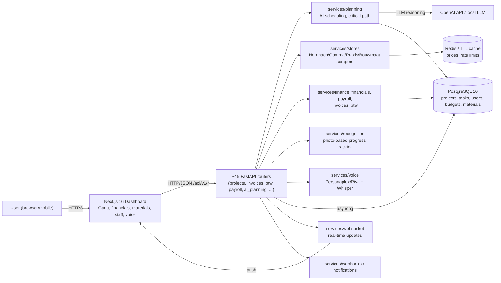

# Architecture — foreman

## What this is

Foreman is a full-stack SaaS business suite for Dutch construction companies ("bouwbedrijven"). Beyond its original pitch of AI task scheduling and material price comparison, the current codebase covers project planning/Gantt, process tracking with photo recognition, Dutch e-invoicing (UBL/Peppol) and BTW (VAT) handling, financial bookkeeping, payroll, staff/subcontractor management, customer quotes/contracts, GPS check-ins and geofencing, safety incidents, permits, Google Reviews, a voice assistant, and hardware-store price comparison (Hornbach, Gamma, Praxis, Bouwmaat). It's a monorepo: FastAPI backend, Next.js 16 frontend, deployed to Kubernetes.

## Components

| Path | Role |
|------|------|
| `src/backend/app/routers/` | ~45 FastAPI routers, one per domain area — e.g. `projects.py`, `ai_planning.py`, `invoices.py`, `btw.py`, `payroll.py`, `staff.py`, `materials.py`, `voice.py`, `weather.py`, `gps_checkin.py`, `websocket.py` |
| `src/backend/app/services/planning/` | AI planning engine: task ordering, critical-path scheduling, dependency/resource/weather-aware plans |
| `src/backend/app/services/stores/` | Hardware store integrations — `hornbach.py`, `gamma.py`, `praxis.py`, `bouwmaat.py` behind a shared `base.py`, aggregated by `comparison.py` |
| `src/backend/app/services/invoices/`, `services/btw/` | Dutch e-invoicing (UBL/Peppol) and VAT (BTW) calculation |
| `src/backend/app/services/finance/`, `services/financials/`, `services/payroll/` | Bookkeeping, financial reporting, and staff payroll |
| `src/backend/app/services/recognition/` | Photo-based process/progress recognition |
| `src/backend/app/services/voice/` | Voice assistant integration (Nvidia Personaplex/Riva, Whisper transcription) |
| `src/backend/app/services/weather/`, `services/health_score/`, `services/process_analytics/` | Supporting services feeding the planning engine and dashboards |
| `src/backend/app/services/reviews/`, `services/notifications/`, `services/webhooks/`, `services/websocket/`, `services/exports/`, `services/calendar/`, `services/quotes/` | Integrations, real-time updates, exports, and quoting |
| `src/backend/app/models/`, `app/schemas/` | SQLAlchemy models (UUID primary keys) and Pydantic schemas |
| `src/backend/alembic/` | Database migrations |
| `src/frontend/app/dashboard/*` | Next.js 16 App Router pages — projects, agenda, financials, invoices, materials, staff, subcontractors, reviews, voice, BTW, etc. |
| `src/frontend/components/{gantt,planning,project-hub,time-tracking,punch-list,...}` | Domain-specific UI: Gantt charts, planning views, time tracking, punch lists |
| `helm/`, `k8s/`, `nginx/`, `docker-compose.yml` | Deployment manifests |

## Tech stack

- **Backend**: Python 3.12, FastAPI, SQLAlchemy + Alembic, PostgreSQL 16
- **Frontend**: Next.js 16 (TypeScript), Tailwind CSS, shadcn/ui
- **AI**: OpenAI API / local LLM for the planning engine's reasoning (must emit human-readable justification per decision)
- **Voice**: Nvidia Personaplex/Riva + Whisper
- **Caching**: Redis / in-memory TTL cache for store prices and rate limiting
- **Payments**: Mollie (Dutch payment provider) for subscriptions
- **Data conventions**: money as integer euro cents, Dutch-locale display, ISO 8601 dates, VAT as integer basis points, SI units for materials, UUID PKs
- **Deploy**: Kubernetes (Helm charts + raw manifests), nginx, Docker Compose for local dev

## Data flow

## How this was produced

The original task assumed "Archify" (`tt-a1i/archify`) was a static-analysis CLI that auto-generates diagrams from source code. It is actually an interactive agent skill for chat-based coding assistants (Cursor/Claude Code/Codex/OpenCode) that renders typed JSON IR into HTML/SVG inside a session — it is not scriptable as a batch CLI, so it was not invoked here. This document was hand-written by an agent reading the repo's `README.md`, `CLAUDE.md` (which documents the domain and data conventions in detail), the pre-existing `docs/architecture/containers.md` stub, and the full `src/backend/app/{routers,services}` and `src/frontend/{app,components}` directory listings.
