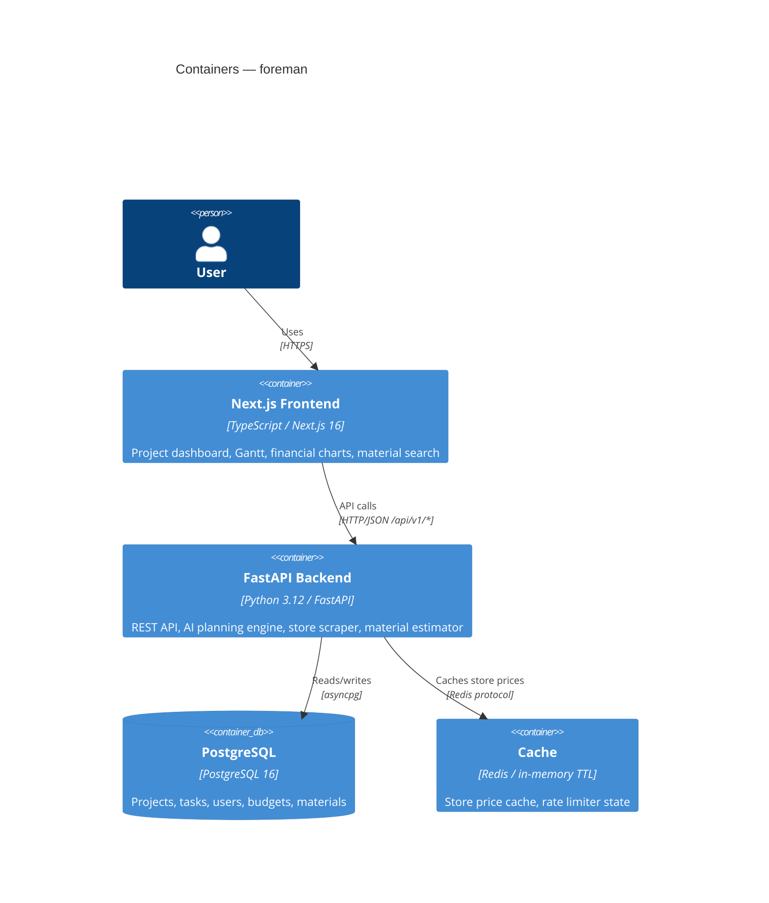

# Containers — foreman

> Stub — populate after first implementation sprint.

```mermaid
C4Container
  title Containers — foreman
  Person(user, "User")
  Container(frontend, "Next.js Frontend", "TypeScript / Next.js 16", "Project dashboard, Gantt, financial charts, material search")
  Container(backend, "FastAPI Backend", "Python 3.12 / FastAPI", "REST API, AI planning engine, store scraper, material estimator")
  ContainerDb(db, "PostgreSQL", "PostgreSQL 16", "Projects, tasks, users, budgets, materials")
  Container(cache, "Cache", "Redis / in-memory TTL", "Store price cache, rate limiter state")
  Rel(user, frontend, "Uses", "HTTPS")
  Rel(frontend, backend, "API calls", "HTTP/JSON /api/v1/*")
  Rel(backend, db, "Reads/writes", "asyncpg")
  Rel(backend, cache, "Caches store prices", "Redis protocol")
```
