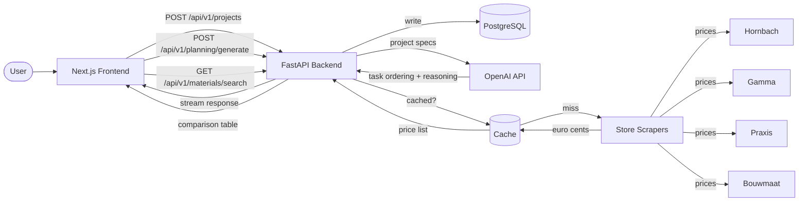

# Data Flow — foreman

> Stub — populate after first implementation sprint.

```mermaid
flowchart LR
    user([User]) --> fe[Next.js Frontend]
    fe -->|POST /api/v1/projects| api[FastAPI Backend]
    api -->|write| db[(PostgreSQL)]

    fe -->|POST /api/v1/planning/generate| api
    api -->|project specs| llm[OpenAI API]
    llm -->|task ordering + reasoning| api
    api -->|stream response| fe

    fe -->|GET /api/v1/materials/search| api
    api -->|cached?| cache[(Cache)]
    cache -->|miss| scrapers[Store Scrapers]
    scrapers -->|prices| hornbach[Hornbach]
    scrapers -->|prices| gamma[Gamma]
    scrapers -->|prices| praxis[Praxis]
    scrapers -->|prices| bouwmaat[Bouwmaat]
    scrapers -->|euro cents| cache
    cache -->|price list| api
    api -->|comparison table| fe
```
