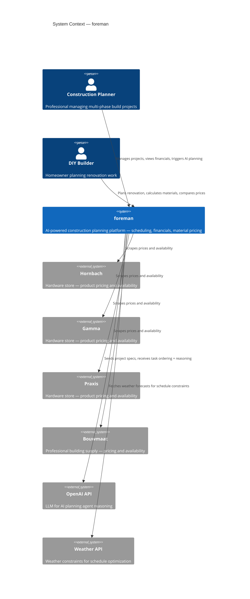

# System Context — foreman

> Stub — populate after first implementation sprint.

```mermaid
C4Context
  title System Context — foreman
  Person(planner, "Construction Planner", "Professional managing multi-phase build projects")
  Person(diy, "DIY Builder", "Homeowner planning renovation work")
  System(foreman, "foreman", "AI-powered construction planning platform — scheduling, financials, material pricing")
  System_Ext(hornbach, "Hornbach", "Hardware store — product pricing and availability")
  System_Ext(gamma, "Gamma", "Hardware store — product pricing and availability")
  System_Ext(praxis, "Praxis", "Hardware store — product pricing and availability")
  System_Ext(bouwmaat, "Bouwmaat", "Professional building supply — pricing and availability")
  System_Ext(ai, "OpenAI API", "LLM for AI planning agent reasoning")
  System_Ext(weather, "Weather API", "Weather constraints for schedule optimization")
  Rel(planner, foreman, "Manages projects, views financials, triggers AI planning")
  Rel(diy, foreman, "Plans renovation, calculates materials, compares prices")
  Rel(foreman, hornbach, "Scrapes prices and availability")
  Rel(foreman, gamma, "Scrapes prices and availability")
  Rel(foreman, praxis, "Scrapes prices and availability")
  Rel(foreman, bouwmaat, "Scrapes prices and availability")
  Rel(foreman, ai, "Sends project specs, receives task ordering + reasoning")
  Rel(foreman, weather, "Fetches weather forecasts for schedule constraints")
```
